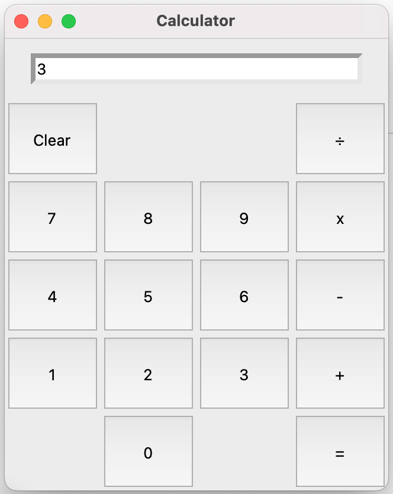

# Python Tkinter Calculator

A simple GUI-based calculator built using Python's `tkinter` library.  
This project demonstrates basic GUI design, event handling, and arithmetic operations in Python.


## Features
- User-friendly graphical interface using Tkinter  
- Supports addition, subtraction, multiplication, and division  
- Clear button to reset input  
- Handles multi-digit inputs  
- Real-time display of entered numbers


## How It Works
1. Users click buttons to input numbers and operators.  
2. The app stores the first number and the chosen operation.  
3. When “=” is pressed, it performs the calculation and displays the result.  
4. “Clear” resets the entry box for new input.


## Tech Stack
- Language: Python 3  
- GUI Framework: Tkinter (built-in with Python)


## File Structure
```
calculator.py        # Main program file
```


## How to Run
1. Ensure you have Python 3 installed.  
2. Download or clone the repository:
   ```bash
   git clone https://github.com/yourusername/tkinter-calculator.git
   cd tkinter-calculator
   ```
3. Run the calculator:
   ```bash
   python calculator.py
   ```


## Interface Preview
You can add a screenshot:
```markdown

```


## Code Overview
- `Entry()` — creates an input field for numbers and results  
- `Button()` — creates clickable calculator buttons  
- Arithmetic functions: `add()`, `subtract()`, `multiply()`, `divide()`  
- `equal()` — executes the operation and displays the result  
- `clear()` — clears the input field


## Example Operations
| Input | Output |
|-------|---------|
| 7 + 3 = | 10 |
| 8 ÷ 2 = | 4 |
| 9 × 5 = | 45 |

